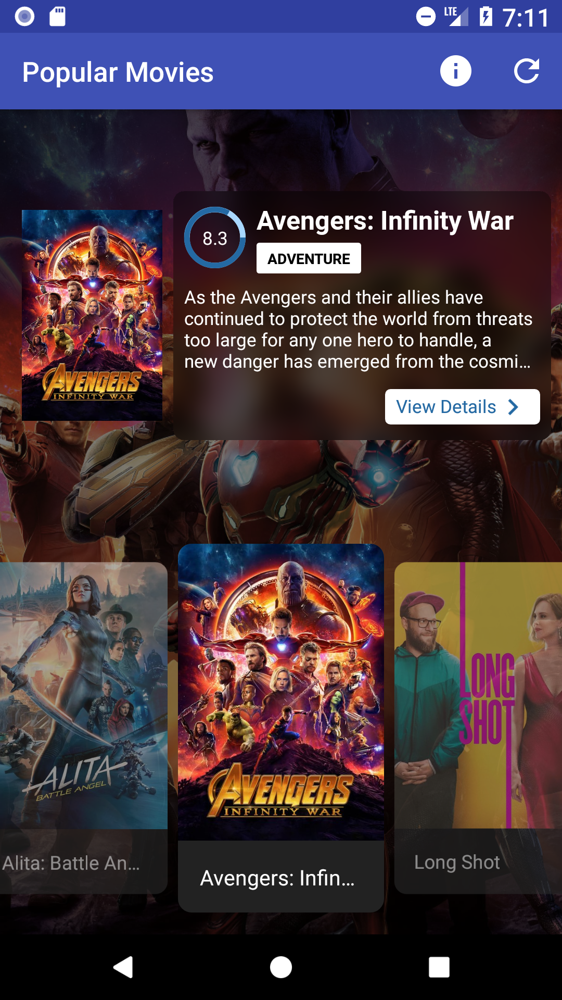
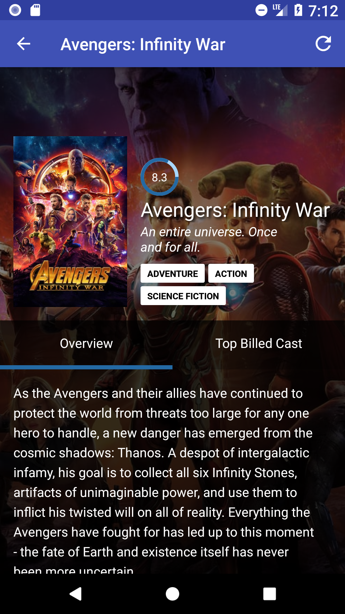

# Movies Reloaded
 

## Who...

### Should look at this project?

Anyone who is interested in using <a target="_blank" href="http://www.electrode.io/site/native.html">**Electrode Native**</a>.

## Where...

### Was this made?
This was made with 💙 at WalmartLabs.

## How...

### Do I run this app?
* `ern platform use 0.37.0` (or a newer version; `ern platform use latest` will always use the newest version)
* For **Android**: `ern run-android`
* For **iOS**: `ern run-ios`

### Can this app hit live APIs?
* Get an API key from <a target="_blank" href="https://www.themoviedb.org">https://www.themoviedb.org</a>
* Open `config.json` and update the `APIKey` with your API key.
* Run the app.

## Why...

### Was this project created?
Integration with native is notoriously difficult, especially if you don't
have experience with Java, Objective-C, and/or Swift.  We wanted to make
navigation as painless as possible while using the native stack and still
allowing native developers full control... and to have a little fun while
doing it.

## What...

### Does Electrode Native Navigation do for me?
**Electrode Native Navigation** allows an <a target="_blank" href="http://www.electrode.io/site/native.html">**Electrode Native**</a> miniapp to quickly and easily set up inter- and intra-miniapp
navigation for any number of miniapps. After setting up a miniapp's components with
the `AppNavigator.RegisterAll()` method, all of your screens will
automatically inherit appropriate navigation bar behavior, including navigation bar
button event listening and dispatching.

### Does this app demonstrate?
This miniapp outlines the different mechanisms that are provided to you by
our  <a target="_blank" href="https://github.com/electrode-io/ern-navigation">**Electrode Native Navigation**</a>.

### Is provided by `Component`?
`<Component>.back()` allows you to go back one screen.  If on
the first screen of your miniapp, it will exit the miniapp.

`<Component>.backTo()` allows you to go back to any screen in
your backstack.

`<Component>.finish()` allows you to finish your current flow.

`<Component>.navigate()` allows you to navigate anywhere in
the application.

`<Component>.navigateInternal()` allows you to navigate
anywhere in the current miniapp.

### Is provided by `AppNavigator`?
`<AppNavigator>.registerAll()` registers all screens which were defined
when constructing the AppNavigator object.

## Acknowledgements
This product uses the TMDb API but is not endorsed or certified by TMDb.

